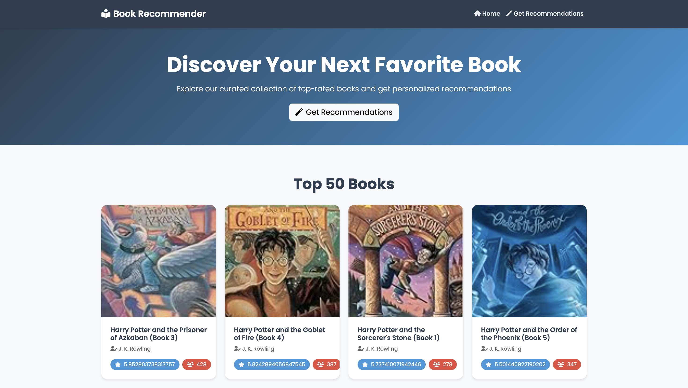
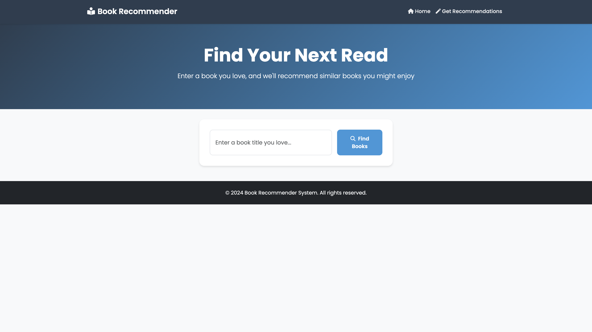

# 📚 Book Recommendation System

A sophisticated web-based book recommendation system that leverages machine learning to help readers discover their next favorite book. Built with Flask and powered by collaborative filtering, this system provides personalized book recommendations based on user preferences and reading history.

## 🖼️ Project Screenshots

### 1. Home Page
<div align="center">
  
  <br>
  <em>Landing page featuring popular books with ratings and user votes</em>
</div>

### 2. Search Interface
<div align="center">
  
  <br>
  <em>Intelligent search interface with smart book recommendations</em>
</div>

### 3. Recommendations
<div align="center">
  
  <br>
  <em>Personalized book recommendations based on user search</em>
</div>

## ✨ Key Features

- 🔍 **Smart Search Engine**
  - Partial text matching
  - Fuzzy search capabilities
  - Case-insensitive search
  - Instant results

- 📊 **Personalized Recommendations**
  - AI-powered book suggestions
  - Similar book discovery
  - Popular books ranking
  - User rating integration

- 🎨 **Modern UI/UX**
  - Clean, intuitive interface
  - Beautiful book cards
  - Responsive design
  - User-friendly navigation

## 🛠️ Technical Stack

- **Backend**: Python, Flask
- **Data Processing**: Pandas, NumPy
- **Machine Learning**: Collaborative Filtering, Cosine Similarity
- **Frontend**: HTML5, CSS3, JavaScript, Bootstrap 5
- **Search**: Fuzzy String Matching, Partial Text Search
- **Deployment**: Gunicorn

## 📦 Project Structure
```
book-recommender-system/
├── app.py                    # Flask application
├── book-recommender-system.ipynb  # EDA and model building
├── books.pkl                 # Processed books data
├── popular.pkl              # Popular books data
├── pt.pkl                   # Pivot table
├── similarity_scores.pkl    # Similarity scores
├── templates/               # HTML templates
│   ├── index.html          # Home page
│   └── recommend.html      # Recommendation page
├── screenshots/            # Project screenshots
├── requirements.txt        # Python dependencies
└── Procfile               # For deployment configuration
```

## 🚀 Getting Started

### Prerequisites
- Python 3.8+
- pip (Python package manager)
- Git

### Installation

1. **Clone the repository**
   ```bash
   git clone https://github.com/yourusername/book-recommender-system.git
   cd book-recommender-system
   ```

2. **Set up virtual environment**
   ```bash
   python -m venv venv
   source venv/bin/activate  # On Windows: venv\Scripts\activate
   ```

3. **Install dependencies**
   ```bash
   pip install -r requirements.txt
   ```

4. **Run the application**
   ```bash
   python app.py
   ```

5. **Access the application**
   Open your browser and visit: `http://localhost:5000`

## 📊 How It Works

### 1. Data Processing
- The system processes the Book-Crossing dataset
- Creates a user-book rating matrix
- Computes similarity scores between books using cosine similarity

### 2. Recommendation Engine
- Uses collaborative filtering to find similar books
- Considers user ratings and book similarities
- Recommends books based on the selected book's characteristics
- Implements smart search with partial matching and fuzzy search

### 3. Search Functionality
- Exact match search
- Partial text matching
- Fuzzy search with adjustable similarity threshold
- Case-insensitive search

## 🔮 Future Improvements

- [ ] User authentication and profiles
- [ ] Advanced recommendation algorithms
- [ ] Book categories and filters
- [ ] Social features
- [ ] Reading lists and bookmarks
- [ ] Dark mode
- [ ] Multi-language support
- [ ] Performance optimization

## 🤝 Contributing

We welcome contributions! Please feel free to submit issues and enhancement requests.

## 📝 License

This project is licensed under the MIT License - see the [LICENSE](LICENSE) file for details.

## 🙏 Acknowledgments

- Book-Crossing dataset
- Flask framework
- Python data science community
- All contributors and supporters

---

<div align="center">
  <sub>Built with ❤️ by [Abhijeet Singh]</sub>
</div> # Book-Recommendation-System
